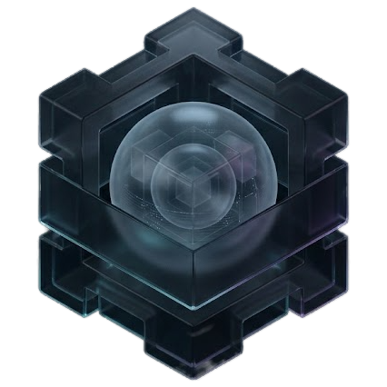
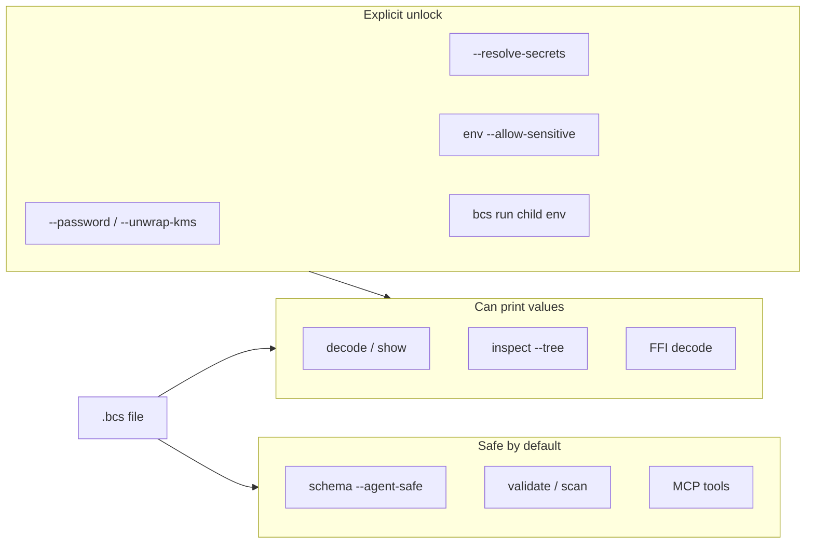

<table>
<tr>
<td rowspan="2"></td>
<td><h1>Binary Config Schema (BCS)</h1></td>
</tr>
<tr>
<td><b>A Rust-first binary configuration format</b> — encode JSON, YAML, or TOML into a compact, inspectable container with optional indexing, compression, integrity checks, and field-level secret protection.</td>
</tr>
</table>

[](https://github.com/trovante/bcs/actions/workflows/ci.yml)
[](https://github.com/trovante/bcs/actions/workflows/release.yml)
[](https://github.com/trovante/bcs/actions/workflows/docs.yml)
[](https://github.com/trovante/bcs/actions/workflows/security.yml)
[](LICENSE)


```bash
# Install CLI (crates.io, after first release)
cargo install bcs-cli

# Or from this repo
cargo install --path cli

bcs encode config.json -o config.bcs
bcs decode config.bcs --path server.host
```

---

## Why BCS?

| | |
|---|---|
| **Binary container** | Practical format for configuration workflows, not a general-purpose serializer |
| **Indexed reads** | Optional index table for fast path queries without full parse |
| **Integrity** | CRC64 checks on the wire format |
| **Sensitive fields** | Password KDF (`pbkdf2`) and/or KMS envelope (`kms`), plus secret references |
| **Multi-language** | Rust core + C ABI bindings for Python, TypeScript, Swift, C#, and Java |
| **Agent MCP** | Optional stdio MCP server (`bcs-mcp`) for schema/inspect/scan/path without secrets — [docs/mcp.md](docs/mcp.md) |

BCS does **not** guarantee smaller files than JSON, nor universal speedups for every workload. Size and latency depend on payload shape and enabled layers — see [measured benchmarks](docs/benchmarks.md).

---

## Quick start

```bash
# Install CLI from crates.io (after release) or from this repo
cargo install bcs-cli
# cargo install --path cli

# Encode / decode
bcs encode examples/test.json -o tmp/config.bcs
bcs decode tmp/config.bcs -o tmp/config.json

# Inspect, validate, query
bcs inspect tmp/config.bcs --verbose
bcs validate tmp/config.bcs
bcs decode tmp/config.bcs --path database.host

# Inject config as process env (any language; no .env files) — docs/env-injection.md
bcs run tmp/config.bcs -- ./my-app
bcs run tmp/config.bcs -- node server.js

# Optional agent MCP server
cargo install bcs-mcp
```

Developer workflow without installing:

```bash
cargo run -p bcs-cli -- encode examples/test.json -o tmp/dev.bcs
cargo run -p bcs-cli -- --help
```

---

## Security surfaces

Safe-by-default commands and MCP tools return metadata, schema, and path names — not secret values. `decode` / `show` / FFI can still print **unprotected** plaintext; revealing protected fields or resolving secret refs requires explicit unlock flags.



Details: [Agents](docs/agents.md), [Protecting fields & secrets](docs/cli-security.md).

---

## Language support

| Language | Location |
|----------|----------|
| Rust (core + CLI) | `core/`, `cli/` |
| C ABI | [`ffi/`](ffi/README.md) |
| Python | `bindings/python` |
| TypeScript / Node | `bindings/typescript` |
| Swift | `bindings/swift` |
| C# / .NET 8 | `bindings/csharp` |
| Java 22+ (FFM) | `bindings/java` |

```bash
cargo build -p bcs-ffi --release
./scripts/package-ffi.sh
./scripts/run-binding-selftests.sh
```

Full guide: [Language Bindings](docs/bindings.md)

---

## Documentation

| Topic | Guide |
|-------|-------|
| CLI reference | [docs/cli-usage.md](docs/cli-usage.md) |
| Protect fields & secrets | [docs/cli-security.md](docs/cli-security.md) |
| Security review | [docs/security-review.md](docs/security-review.md) |
| Format specification | [spec/format.md](spec/format.md) |
| Rust API | [docs/api-reference.md](docs/api-reference.md) |
| Examples | [docs/examples.md](docs/examples.md) |
| Benchmarks | [docs/benchmarks.md](docs/benchmarks.md) |
| Development | [docs/development.md](docs/development.md) |
| Agent / MCP | [docs/agents.md](docs/agents.md), [docs/mcp.md](docs/mcp.md) |

Browse the full index: **[docs/README.md](docs/README.md)**

---

## Project layout

```text
bcs/
├── spec/         Format specification
├── core/         Rust core library
├── secrets/      Optional secret/KMS providers (feature-gated)
├── cli/          Command-line tool
├── ffi/          C ABI
├── bindings/     Python, TypeScript, Swift, C#, Java
├── examples/     Sample configs
├── benchmarks/   Baselines and measured snapshots
├── docs/         Guides and references
└── scripts/      Utility scripts
```

---

## Contributing

See [CONTRIBUTING.md](CONTRIBUTING.md) and [docs/development.md](docs/development.md).

## License

MIT — see [LICENSE](LICENSE).

## Status

**v0.1.0** (alpha) — first public release; the format and APIs may evolve before `1.0`.
See [CHANGELOG.md](CHANGELOG.md) and [SECURITY.md](SECURITY.md).
