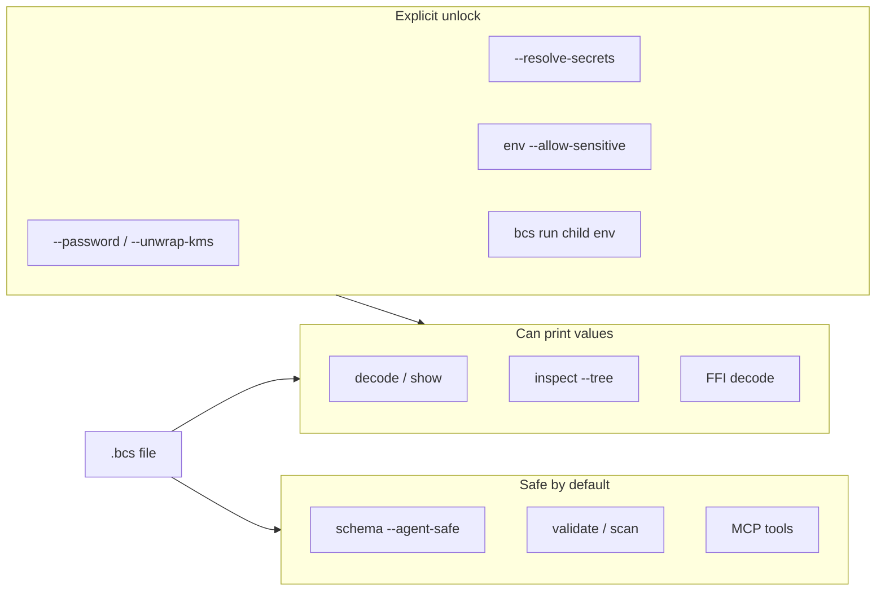

# Agents and BCS

How coding agents should work with BCS without exposing secrets.

## Security surfaces

Prefer the **safe by default** lane (schema, validate, scan, MCP). Value-printing commands can expose unprotected plaintext; protected fields and secret refs stay masked until an operator unlocks them.



Also shown in the [root README](../README.md#security-surfaces) and [cli-security.md](cli-security.md).

## Agent-safe schema

```bash
bcs schema --agent-safe file.bcs
# or
bcs schema --agent-safe --export agent-schema.json file.bcs
```

The export lists paths, types, required flags, documentation, constraints, and `sensitive` — **never** data-layer values. FFI: `bcs_schema_export_json`.

Contract details: [agent-schema.md](agent-schema.md).

## Sensitivity source of truth

| Mechanism | Role |
|-----------|------|
| `Schema.sensitive_paths` | Source of truth for agent-safe / validate / scan |
| `--protect-paths` | Encrypts values **and** stamps sensitive paths |
| `--sensitive-paths` | Schema-only mark (no encryption) for docs/CI |
| `AISemanticTag.sensitivity` | Optional enrichment only |

## Validate policy

- Default: **warn** when a sensitive path holds plaintext (not a protect marker or secret ref).
- Strict CI: `bcs validate --fail-on-sensitive-plaintext`.

## Security hygiene

- Do not request protect passwords in agent transcripts.
- Prefer masked decode / path get; unlock only with explicit operator flags.
- Use `bcs scan` (CLI or MCP `bcs_scan`) in CI to catch leaked keys in sources and `.bcs` files.

## MCP

When `bcs-mcp` is configured, prefer tools `bcs_schema`, `bcs_inspect_meta`, `bcs_validate`, `bcs_scan`, and `bcs_get_path` over dumping full decoded configs. Setup: [mcp.md](mcp.md).

## Related

- [cli-security.md](cli-security.md)
- [secrets.md](secrets.md)
- [mcp.md](mcp.md)
- [roadmap-varlock-rx-ideas.md](roadmap-varlock-rx-ideas.md)
