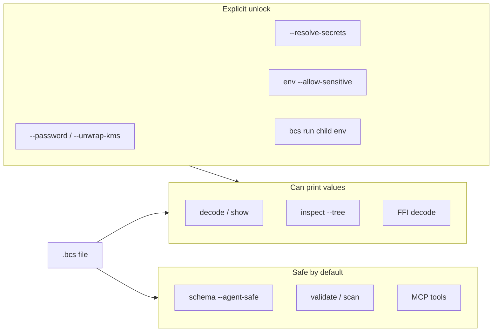

# Protecting Fields & Resolving Secrets (CLI)

CLI recipes for sensitive-field protection and secret references. For scheme design and production identity guidance, see [identity.md](identity.md) and [secrets.md](secrets.md).

Sample config: `examples/secure-config.json`.

Note that `api.token` in the sample is a secret reference, so protect fields such as `database.password` unless you intentionally encrypt the reference string itself.

## Schemes at a glance

Two coexistable schemes (distinct marker prefixes — no v1/v2 tags):

| Scheme | Prefix | CLI |
|--------|--------|-----|
| `pbkdf2` (default) | `__bcs_sensitive_pbkdf2__:` | password / password-env |
| `kms` | `__bcs_sensitive_kms__:` | `--scheme kms` + `--kms-provider` + `--kms-key` |

## Password (`pbkdf2`)

```bash
bcs encode examples/secure-config.json -o config.secure.bcs \
  --protect-paths "database.password" \
  --protect-password "my-secret"
```

Protect selected fields from file (one path per line, `#` comments allowed):

```bash
bcs encode examples/secure-config.json -o config.secure.bcs \
  --protect-paths-file sensitive-paths.txt \
  --protect-password "my-secret"

# Use environment variable instead of plaintext password flag
BCS_PROTECT_PASSWORD="my-secret" \
bcs encode examples/secure-config.json -o config.secure.bcs \
  --protect-paths-file sensitive-paths.txt \
  --protect-password-env BCS_PROTECT_PASSWORD
```

Protect an already-generated BCS file:

```bash
bcs protect config.bcs -o config.protected.bcs \
  --paths "database.password" \
  --paths-file sensitive-paths.txt \
  --password "my-secret"

# Protect with default output path (<input>.protected.bcs)
bcs protect config.bcs --paths "database.password" --password "my-secret"

# Protect existing file using env password
BCS_PROTECT_PASSWORD="my-secret" \
bcs protect config.bcs -o config.protected.bcs \
  --paths-file sensitive-paths.txt \
  --password-env BCS_PROTECT_PASSWORD

# Protect JSON output (CI-friendly)
bcs protect config.bcs --paths "database.password" --password "my-secret" --json
```

If `--password` / `--protect-password` and the env variants are omitted, the CLI
prompts interactively (preferred over putting secrets on the command line).

Decode behavior:

```bash
# Without password: protected values are masked
bcs decode config.secure.bcs

# With password: protected values are revealed
bcs decode config.secure.bcs --password "my-secret"

# With password from environment
BCS_DECODE_PASSWORD="my-secret" \
bcs decode config.secure.bcs --password-env BCS_DECODE_PASSWORD
```

## KMS envelope (`kms`)

Build the CLI with the matching feature (`secrets-aws`, `secrets-azure`,
`secrets-gcp`, `secrets-vault`, or `secrets-all`). Provider `cmd` needs no
extra feature and shells out via `BCS_KMS_WRAP_CMD` / `BCS_KMS_UNWRAP_CMD`.

```bash
# Protect with native AWS KMS (example)
bcs protect config.bcs -o config.kms.bcs \
  --paths "database.password" \
  --scheme kms --kms-provider aws --kms-key alias/app-key

# Or during encode
bcs encode examples/secure-config.json -o config.kms.bcs \
  --protect-paths "database.password" \
  --protect-scheme kms --kms-provider aws --kms-key alias/app-key

# Reveal on decode
bcs decode config.kms.bcs --unwrap-kms --kms-provider aws
```

## Secret references

Prefer secret references when the value should live outside the file (env, Vault,
AWS/Azure/GCP secret managers, and other providers — see [secrets.md](secrets.md)).
Store the marker string in JSON:

```text
__bcs_secret_ref__:env:API_TOKEN
__bcs_secret_ref__:secret:api_token
```

Both `env:` and logical `secret:` refs can be resolved in this release.
With the default provider (`env`), `secret:NAME` remaps to the environment
variable `NAME`. Use an explicit scheme (`env:`, `vault:`, `aws:`, `azure:`, `gcp:`) to pin a backend.

```bash
# Encode a config that already contains secret-ref markers
bcs encode examples/secure-config.json -o config.refs.bcs

# Default decode: refs are masked (not resolved)
bcs decode config.refs.bcs
# api.token -> "[SECRET_REF]"

# Opt-in resolve via the env provider (default)
API_TOKEN="tok_live" bcs decode config.refs.bcs --resolve-secrets

# Stream decode also supports password reveal and secret resolve/mask
API_TOKEN="tok_live" bcs decode config.refs.bcs --stream --resolve-secrets

# Explicit provider selection
API_TOKEN="tok_live" bcs decode config.refs.bcs \
  --resolve-secrets --secret-provider env

# HashiCorp Vault (CLI default feature `secrets-vault`)
VAULT_ADDR=https://vault.example.com VAULT_TOKEN=... \
  bcs decode config.refs.bcs --resolve-secrets --secret-provider vault

# AWS Secrets Manager (build with --features secrets-aws)
AWS_REGION=us-east-1 \
  bcs decode config.refs.bcs --resolve-secrets --secret-provider aws

# Azure Key Vault (build with --features secrets-azure)
AZURE_ACCESS_TOKEN=... AZURE_KEY_VAULT_URL=https://myvault.vault.azure.net \
  bcs decode config.refs.bcs --resolve-secrets --secret-provider azure

# Google Secret Manager (build with --features secrets-gcp)
GOOGLE_ACCESS_TOKEN=... GOOGLE_CLOUD_PROJECT=my-proj \
  bcs decode config.refs.bcs --resolve-secrets --secret-provider gcp

# Other providers (Doppler, Infisical, Akeyless, Bitwarden, OpenBao): see secrets.md

# Or via environment
BCS_SECRET_PROVIDER=env API_TOKEN="tok_live" \
  bcs decode config.refs.bcs --resolve-secrets
```

## How the layers relate

Password-based protection, KMS envelope protect, and secret refs are independent:
password/`kms` encrypt values into the file; refs keep only a pointer and
materialize at decode when requested.

CLI and MCP surfaces fall into three lanes: safe-by-default (no secret values),
value-printing (unprotected plaintext may appear), and explicit unlock (reveal /
resolve / inject):



For production, prefer secret refs plus short-lived OIDC/IAM/workload identity
instead of long-lived tokens — see [identity.md](identity.md). Agent guidance:
[agents.md](agents.md).

### Decode / show plaintext policy

When a file has an embedded schema with `sensitive_paths`, decode and show can
opt into the same policy validate uses:

```bash
# Replace sensitive plaintext with [SENSITIVE]
bcs decode config.bcs --redact-sensitive-plaintext
bcs show config.bcs -f json --redact-sensitive-plaintext

# Refuse to print if sensitive paths still hold plaintext
bcs decode config.bcs --fail-on-sensitive-plaintext
```

Prefer `--password-env` (or a prompt) over `--password` on the command line —
the CLI warns when a password is passed via argv. Full write-up:
[security-review.md](security-review.md).
