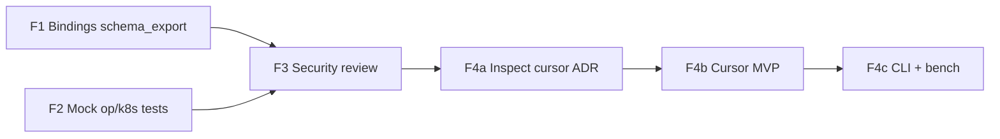

# Follow-up plan: Inspect cursor & remaining gaps

Implementation plan for work left after the [Varlock / RX roadmap](roadmap-varlock-rx-ideas.md) milestones landed. Covers:

1. True **offset-based InspectNode** (conscious limitation)
2. **`schema_export` in C# / Swift / Java**
3. **Mock tests** for 1Password / Kubernetes resolvers
4. **Formal security review** of scan / run / agent-safe / MCP surfaces

**Product boundary (unchanged):**

- No RX-style Proxy in every language binding.
- No static HTML viewer required for “cursor done”.
- No live cloud calls in default CI for secret providers.

---

## Current state

| Item | Today | Gap |
|------|--------|-----|
| Inspect AST | Offset cursor (indexed root + wire walk); Value fallback for leaves | — |
| Schema export FFI | All first-party bindings (Py/TS/C#/Swift/Java) | — |
| `op` / `k8s` providers | Injectable `CommandRunner` + mock tests | — |
| Security | [adr/security-review-followups.md](adr/security-review-followups.md); symlink skip | — |

---

## Sequencing

| Phase | Theme | Effort | Depends on | Status |
|-------|--------|--------|------------|--------|
| **F1** | C# / Swift / Java `schema_export` | S | — | Done |
| **F2** | Injectable command runner + mock tests | S | — | Done |
| **F3** | Scoped security review + findings triage | S | Soft: F1–F2 | Done |
| **F4** | Inspect offset cursor (ADR → MVP → CLI/bench) | M–L | F3 preferred | Done |

**All follow-up phases completed.**

---

## F1 — Bindings: `schema_export` (C# / Swift / Java)

**Status:** Done (C# / Swift / Java + selftests; Python/TS already shipped)

Acceptance: [x] FFI wrappers + selftests that reject planted secret values in export.

---

## F2 — Mock tests for 1Password & Kubernetes

**Status:** Done — [adr/secret-cli-runner.md](adr/secret-cli-runner.md)

Acceptance: [x] `cargo test -p bcs-secrets --features onepassword,kubernetes` without real CLIs.

---

## F3 — Formal security review

**Status:** Done — [adr/security-review-followups.md](adr/security-review-followups.md)

### Outcome

| Severity | Finding | Disposition |
|----------|---------|-------------|
| should-fix | `scan_dir` followed symlinks | **Fixed** — skip symlink entries |
| accept | Scan messages use pattern kind only (no matched secret text) | Accept |
| accept | Dry-run / MCP / path get masking | Accept |
| accept | `op`/`kubectl` argv-only runners | Accept |

### Acceptance criteria

- [x] Written review artifact exists
- [x] No open blockers
- [x] Release checklist references the review

---

## F4 — Offset-based Inspect cursor

**Goal:** `inspect --tree` / `dump` do not require `decode_to_value()` for the full document.

### F4a — ADR

**Status:** Done — [adr/inspect-cursor.md](adr/inspect-cursor.md) (Implemented)

### F4b — MVP

**Status:** Done

- Indexed root → children from index table (no full decode)
- Nested struct/list/map → wire enumerate + `skip_value`
- Leaves → decode only that slice; protect/secret masked
- Tests in `core/src/inspect_ast.rs`

### F4c — CLI + benchmarks

**Status:** Done

- CLI already uses `InspectNode::from_decoder`
- Documented in [benchmarks.md](benchmarks.md) Interpretation notes
- Main roadmap item 11 marked Done (offset cursor)

---

## Tracking checklist

| # | Item | Phase | Status |
|---|------|-------|--------|
| 1 | C# `schema_export` + selftest | F1 | Done |
| 2 | Swift `schema_export` + selftest | F1 | Done |
| 3 | Java `schema_export` + selftest | F1 | Done |
| 4 | CommandRunner + `op` mock tests | F2 | Done |
| 5 | CommandRunner + `k8s` mock tests | F2 | Done |
| 6 | Security review artifact + blockers fixed | F3 | Done |
| 7 | ADR inspect cursor | F4a | Done |
| 8 | Cursor MVP + tests | F4b | Done |
| 9 | CLI dump/inspect + bench note | F4c | Done |

---

## Shippable milestones

1. **“Agent-safe everywhere”** — F1 ✅  
2. **“Providers testable in CI”** — F2 ✅  
3. **“Security sign-off”** — F3 ✅  
4. **“Large-file inspect”** — F4 ✅  

---

## Open questions (resolved)

1. **Scan report redaction:** kind only — never matched substrings (F3).
2. **Cursor fallback:** leaf/unknown tags use `from_value` (F4b).
3. **Symlinks in `scan` dirs:** skip all symlink entries (F3).
