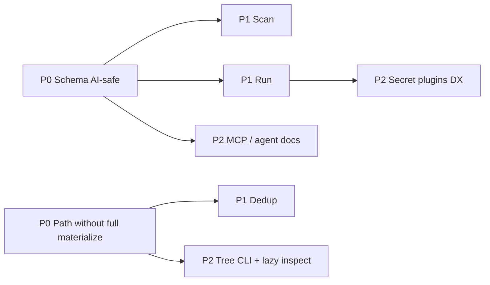

# Roadmap: Ideas from Varlock & RX

Implementation plan for the improvements proposed after comparing BCS with [Varlock](https://github.com/dmno-dev/varlock) and [RX](https://github.com/creationix/rx). See also [comparison-varlock-rx.md](comparison-varlock-rx.md).

**Product boundary (do not cross):**

- BCS stays a **binary config container**, not an `.env` multi-env platform (Varlock) and not a giant write-once data store (RX).
- Prefer opt-in layers and CLI/API surface that compose with existing encode → ship → decode/protect/secrets workflows.

**Current baseline (repo today):**

| Area | Exists today | Gap vs this roadmap |
|------|--------------|---------------------|
| Schema | `sensitive_paths`; `schema --agent-safe`; validate warn/fail policy | — |
| Path get | Indexed path + decompress cache; optional nested struct indexes (`--index-maps-over`) | — |
| Protect / secrets | Path markers + resolvers + `scan` / `run` + `bcs-mcp` | — |
| Size | Optional LZ4; opt-in structural dedup (`--dedup`) | — |
| DX | `inspect --tree`, `show`, `dump` | Static HTML viewer optional |

---

## Goals & non-goals

### Goals

1. **Agent-safe contract** — humans and agents can read shape + sensitivity without secret values.
2. **Honest partial reads** — path access is the default story for indexed files, including compressed data where feasible.
3. **Ops security loop** — scan before ship; resolve at run; fail closed on sensitive plaintext.
4. **Better size story** — optional structural sharing so “can be larger than JSON” is not the only outcome.
5. **Ops DX** — tree/path CLI and inspect that respect protect/secret markers.

### Non-goals

- Replacing Varlock for JS `.env` workflows or framework integrations (Next/Vite/Astro).
- Matching RX on 90 MB manifests / microsecond Proxy stores as the primary use case.
- Making text-RX a wire format (debug dumps only).
- Enabling the reserved header `AI_METADATA` bit without a versioned, documented extension.

---

## Phases overview

| Phase | Theme | Origin | Depends on |
|-------|--------|--------|------------|
| **P0-A** | Schema export + sensitive tags | Varlock | — |
| **P0-B** | Path get without full-document materialize | RX | — |
| **P1-A** | `bcs scan` | Varlock | P0-A (sensitive tags) |
| **P1-B** | Opt-in structural dedup | RX | P0-B (index/data layout clarity) |
| **P1-C** | `bcs run` | Varlock | P0-A (optional), secrets/protect as today |
| **P2-A** | Tree CLI + lazy inspect AST | RX | P0-B |
| **P2-B** | MCP / AGENTS docs | Varlock | P0-A |
| **P2-C** | Productized secret plugins (1Password, K8s) | Varlock | P1-C nice-to-have |

P0-A and P0-B can run **in parallel**. P1 items can partially overlap after their P0 deps land.

---

## P0-A — Schema “AI-safe” + sensitive tags

**Why:** Varlock’s strongest idea for BCS is a single contract agents can read without secrets. BCS already has schema + `ai_tags`; wire sensitivity into the real product path.

### Work items

1. **Schema model**
   - Add `sensitive: bool` (and optionally `secret_ref_allowed`) on `FieldDefinition` and/or path-keyed map on `Schema` (e.g. `sensitive_paths`).
   - Prefer **path-keyed** sensitivity so inferred schemas and protect-path lists stay aligned with `parse_path`.
   - Keep `AISemanticTag.sensitivity` as optional enrichment, not the source of truth.

2. **Encode / protect integration**
   - `--protect-paths` / `--protect-paths-file` mark those paths sensitive in the embedded schema when schema is written.
   - Allow declaring sensitivity without encrypting (schema-only) via `--sensitive-paths` for docs/CI.
   - `validate`: fail (or warn under flag) if a path marked sensitive holds plaintext (not protect marker, not secret-ref marker).

3. **Export contract**
   - Extend `bcs schema --export` (or `bcs schema --agent-safe`) to emit JSON: paths, types, required, constraints, docs, **sensitive**, **never values**.
   - Redact rules: omit defaults that look like secrets; never expand protect/secret markers into plaintext.
   - Document the JSON shape in `docs/cli-json-output.md` (or a small `docs/agent-schema.md`).

4. **Inspect**
   - `bcs inspect` / `--verbose`: list sensitive path count and names; do not print values for those paths.

5. **FFI / bindings (minimal)**
   - `bcs_schema_export_json` (agent-safe) so Python/TS/etc. can surface the contract without decode.

### Acceptance criteria

- [x] Round-trip: encode with protect paths → exported schema lists those paths as `sensitive: true`.
- [x] Export contains no field values from the data layer.
- [x] `validate` can reject sensitive plaintext under an explicit policy flag (default policy documented).
- [x] Unit + CLI tests; binding selftest for schema export if FFI added.

### Risks / decisions

- **Inferred vs authored schema:** inference should mark sensitivity only when protect/sensitive flags are passed, not by guessing.
- **Compatibility:** additive schema MessagePack fields; old readers ignore unknown keys if using map-based schema — verify `Schema` serde/msgpack compatibility policy.
- **Sensitive plaintext policy (resolved):** warn by default; fail with `--fail-on-sensitive-plaintext`.

### Suggested ownership / files

- `core/src/schema.rs`, `core/src/security.rs`, `core/src/encoder.rs`
- `cli/src/commands/schema.rs`, `validate.rs`, `inspect.rs`, `encode.rs`
- `ffi/`, `docs/`

**Estimate:** M (1–2 weeks focused)

**Status:** Done (Milestone 1)

---

## P0-B — Path access without full-document materialize

**Why:** RX’s lesson is that partial read must be the *default mental model*. BCS already has `Decoder::get` (not full-file decode); harden and market that path, close compression/index gaps.

### Work items

1. **Document & API clarity**
   - Public Rust helpers: `Decoder::get_path` alias or docs that state subtree decode only.
   - Benchmarks: keep indexed path vs full decode separate (already in benchmarks docs); add a gate that path get stays ≪ full decode on medium fixtures.

2. **Compressed data + path**
   - Today path lookup is blocked when `DATA_COMPRESSION` is set. Options (pick one in implementation ADR):
     - **A (preferred short-term):** decompress data layer once into a cached buffer on first `get`, then path-query; or
     - **B:** frame/chunk compression so offsets remain valid; or
     - **C:** disallow combining `--compress-data` with `--index` (encode-time policy) and document it.
   - Prefer A unless format change is already planned.

3. **Nested / richer index (incremental)**
   - Complete or replace incomplete `IndexTableLookup::lookup_path` for nested segments where offsets are known without walking JSON values.
   - Optional: local sorted key indexes for large maps (threshold flag, RX-style) — can slip to P1-B if scope explodes.

4. **CLI**
   - Ensure `decode --path` never calls `decode_to_value` for the root when index exists (audit `decode_partial`).
   - Add metrics line under `--json` / verbose: `access=indexed|walk|full`.

5. **FFI**
   - Keep masking on `bcs_get_path_json`; add optional flag later for reveal-with-password (out of P0).

### Acceptance criteria

- [x] Documented guarantee: path get does not build the full value tree when index present.
- [x] Decision recorded for compress+path; implemented or encode rejects unsafe combo.
- [x] Tests: large-ish nested fixture; path get allocates/decodes only subtree (or regression bench).
- [x] Fuzz target `get_path` still green.

### Risks / decisions

- Nested offset walking vs true random access — do not claim O(log n) for deep paths until local indexes exist.
- Format stability: prefer no header change in P0; nested indexes may need a version bump if on-disk layout changes → park behind feature flag / v1.1 discussion.
- **Compress + path (resolved):** option A — cache decompress on first `get` ([docs/adr/compress-path.md](adr/compress-path.md)).

### Suggested ownership / files

- `core/src/decoder.rs`, `core/src/index.rs`, `core/src/encoder.rs`
- `cli/src/commands/decode.rs`, `docs/benchmarks.md`, `docs/performance-gates.md`
- `fuzz/fuzz_targets/get_path.rs`

**Estimate:** M–L (1–3 weeks depending on compress strategy)

**Status:** Done (Milestone 2). Nested local indexes shipped later with P1-B (`--index-maps-over`).

---

## P1-A — `bcs scan`

**Why:** Varlock’s leak scanning is high leverage for CI and AI-generated configs.

### Work items

1. **Command:** `bcs scan <path>` (file or directory)
   - Inputs: JSON / YAML / TOML sources and/or `.bcs` files.
   - Detectors:
     - Regex entropy / known patterns (AWS keys, tokens, PEM, etc.) — start with a small curated set + extensible list.
     - Schema policy: sensitive path with plaintext value.
     - Unresolved intent: string that looks like a secret but path not in protect/sensitive list (warn).
   - Exit codes: `0` clean, `1` findings, `2` tool error.
   - `--json` for CI; `--fail-on warn|finding`.

2. **Git / CI hooks (docs + optional script)**
   - Example: [`scripts/scan-ci-example.sh`](../scripts/scan-ci-example.sh) for pre-commit / CI.
   - Do not vendor a heavy scanner engine in v1; stay dependency-light.

3. **Tests:** golden fixtures with planted secrets; ensure protect markers / secret refs are not false-positived as leaks.

### Acceptance criteria

- [x] Scans example `secure-config.json` appropriately (refs vs plaintext).
- [x] CI-friendly JSON contract documented.
- [x] No network calls.

### Depends on

- P0-A for schema-sensitive checks; pattern-only scan can ship earlier behind a flag.

**Estimate:** S–M (about 1 week)

**Status:** Done (Milestone 3)

---

## P1-B — Opt-in structural dedup

**Why:** RX shows size wins from shared keys/strings; BCS should offer an opt-in path so configs with repeated shapes shrink without becoming a general data store.

### Work items

1. **Design ADR**
   - Intern repeated strings / map key tables within the data layer (or a side dictionary section).
   - Compatibility: only readers that understand the flag can decode — use a **header flag** or data-tag extension with version bump policy ([compatibility-policy.md](compatibility-policy.md)).

2. **Encode flags**
   - `--dedup keys|strings|all` with thresholds (min repeats, min string length).
   - Default **off** to preserve current behavior and benchmarks.

3. **Decode / path**
   - Transparent resolution in `Decoder` so `get` still works.
   - Benchmarks: size delta on `examples/` + a synthetic repetitive fixture; record in `benchmarks/`.

4. **Local map indexes (if not done in P0-B)**
   - Threshold `--index-maps-over N` for large objects.

### Acceptance criteria

- [x] Opt-in only; old files unchanged.
- [x] Round-trip equality of logical document.
- [x] Measured size improvement on at least one repetitive fixture; no catastrophic path-get regression.

### Depends on

- P0-B clarity on offsets / compression interaction.

**Estimate:** L (format-sensitive; 2–4 weeks)

**Status:** Done (Milestone 4) — see [adr/structural-dedup.md](adr/structural-dedup.md); CLI `--dedup` / `--index-maps-over`.

---

## P1-C — `bcs run`

**Why:** Bridge packaged file → process env/args the way `varlock run` does, without owning `.env` authoring.

### Work items

1. **Command:** `bcs run <file.bcs> -- <command>...`
   - Decode (optional `--path` subtree as JSON file / env).
   - Modes:
     - `--export-env` flatten selected paths to `KEY=value` (document flattening rules; nested → `DATABASE__HOST` or JSON-in-one-var).
     - `--resolve-secrets` / protect password/KMS flags (reuse decode stack).
     - Default: run child with env overlay; never print secrets to stdout.
   - `--dry-run` prints keys only (redacted).

2. **Safety**
   - Refuse to export sensitive values to the terminal; only into child env when explicitly requested.
   - Align with P0-A sensitive tags for which keys are redacted in dry-run.

3. **Docs:** recipe in `docs/cli-usage.md` + security notes in `docs/cli-security.md`.

### Acceptance criteria

- [x] `bcs run examples/... -- env | grep` shows only non-sensitive or redacted dry-run.
- [x] Child process sees resolved secrets when flags allow.
- [x] Integration test with a stub command.

### Depends on

- Soft: P0-A for redaction lists. Hard: existing decode/protect/secrets.

**Estimate:** S–M (about 1 week)

**Status:** Done (Milestone 3)

---

## P2-A — Tree CLI + lazy inspect AST

**Why:** RX CLI/UX (`show` segments, tree on TTY, JSON when piped) and lazy inspect AST are strong ops DX.

### Work items

1. **`bcs show [file] [segment...]`**
   - Alias ergonomics over `decode --path` with segment argv (`database host` → `database.host`).
   - `-f tree|json` ; default tree on TTY, json when piped (`NO_COLOR` / `BCS_FORMAT`).

2. **Lazy inspect AST (library)**
   - `InspectNode` over data layer: tag/type, offset, children lazy; protect/secret leaves stay markers unless unlocked.
   - CLI `inspect --tree` uses it; no full `serde_json::Value` for large files.

3. **Optional debug dump**
   - `bcs dump --format debug-tree` copy-pasteable for tickets (not a second wire format).
   - Optional later: static HTML viewer (out of core; `docs` or small `tools/`).

### Acceptance criteria

- [x] `show` path parity with `decode --path`.
- [x] Tree mode never prints revealed secrets without unlock flags.
- [x] Inspect/dump use `InspectNode` (masking-aware). **Note:** v1 builds the node from a decoded `Value` (full logical document); children expand lazily. Offset-only cursor AST remains a follow-up.

### Depends on

- P0-B for reliable partial access under compression policy.

**Estimate:** M (1–2 weeks)

**Status:** Done (`show`, `inspect --tree`, `dump --format debug-tree`; InspectNode library — Value-backed lazy children)

---

## P2-B — MCP / agent docs

**Why:** Varlock ships docs MCP and agent-oriented guidance; BCS can do the same cheaply once agent-safe schema exists.

### Work items

1. **`AGENTS.md`** (repo root): how to encode/validate/inspect; **never** ask for protect passwords in chat; use `schema --agent-safe`.
2. **Docs page:** `docs/agents.md` — workflows for coding agents.
3. **MCP server** (`mcp/` binary `bcs-mcp`, stdio via `rmcp`, backed by `bcs-core`):
   - Tools: `bcs_schema`, `bcs_inspect_meta`, `bcs_validate`, `bcs_scan`, `bcs_get_path` (masked; no password unlock).
   - Shared scan engine in `bcs-core` so CLI and MCP stay aligned.
4. **README** / [docs/mcp.md](mcp.md) once stable.

### Acceptance criteria

- [x] Agent guide exists (`AGENTS.md`, `docs/agents.md`) against P0-A export shape.
- [x] MCP server ships stdio tools (`bcs_schema`, `bcs_inspect_meta`, `bcs_validate`, `bcs_scan`, `bcs_get_path`) — see [mcp.md](mcp.md).

### Depends on

- P0-A; P1-A for `scan` tool.

**Estimate:** S (docs), M if MCP included

**Status:** Done (docs + `bcs-mcp` stdio server; [adr/mcp-server.md](adr/mcp-server.md)).

---

## P2-C — Productized secret plugins (1Password, Kubernetes)

**Why:** BCS already has many cloud/Vault-class resolvers; Varlock wins on password-manager and K8s DX.

### Work items

1. **Providers**
   - `op://` / 1Password Connect or CLI-backed resolver (feature-gated).
   - Kubernetes secret resolver (in-cluster or kubeconfig) — feature-gated.
2. **Docs per provider** — same template as [secrets.md](secrets.md): locator syntax, auth, timeouts, examples.
3. **`bcs run` + encode examples** using new schemes.
4. **CI:** unit tests with mocks; no live cloud in default CI.

### Acceptance criteria

- [x] Feature flags documented in Cargo features table.
- [x] Self-test or mock integration for each new provider.
- [x] Security notes: prefer short-lived tokens / workload identity ([identity.md](identity.md)).

### Depends on

- Soft: P1-C for end-to-end recipes.

**Estimate:** M each provider (1–2 weeks apiece)

**Status:** Done (CLI features `secrets-onepassword`, `secrets-kubernetes`; kubectl / `op` CLI backends)

---

## Cross-cutting work

| Item | Notes |
|------|--------|
| **Compatibility policy** | Any on-disk flag (dedup, nested index) goes through [compatibility-policy.md](compatibility-policy.md) + CHANGELOG |
| **Benchmarks** | Update `scripts/record-benchmarks.sh` / gates when path or dedup lands |
| **Security review** | Scan + run + schema export: treat as security-sensitive; consider security-review before release |
| **Bindings** | FFI first for schema export & path; language bindings follow via existing wrappers |
| **Docs index** | Link this roadmap from [docs/README.md](README.md); keep comparison doc as positioning |

---

## Suggested sequencing (quarters-style)

Assuming one focused engineer (adjust for parallel tracks):

| Window | Deliverables |
|--------|----------------|
| **Sprint 1–2** | P0-A + P0-B (parallel if two people; else A then B) |
| **Sprint 3** | P1-A `scan` + start P1-C `run` |
| **Sprint 4** | Finish P1-C; ADR + spike for P1-B dedup |
| **Sprint 5–6** | P1-B dedup MVP (strings/keys) |
| **Sprint 7** | P2-A tree/`show` + lazy inspect |
| **Sprint 8** | P2-B docs/MCP; P2-C first provider (K8s or 1Password) |

Shippable milestones for users:

1. **“Agent-safe BCS”** — P0-A (+ P2-B docs)
2. **“Trusted path reads”** — P0-B
3. **“CI security loop”** — P1-A + P1-C
4. **“Smaller repetitive configs”** — P1-B
5. **“Ops CLI polish”** — P2-A
6. **“Broader secret DX”** — P2-C

---

## Tracking checklist (all suggestions)

| # | Suggestion | Phase | Status |
|---|------------|-------|--------|
| 1 | Schema AI-safe export | P0-A | Done |
| 2 | Sensitive tags in embedded schema | P0-A | Done |
| 3 | `bcs scan` | P1-A | Done |
| 4 | `bcs run` | P1-C | Done |
| 5 | Secret plugins DX (1Password, K8s) | P2-C | Done |
| 6 | MCP / agent docs | P2-B | Done (`bcs-mcp`; [mcp.md](mcp.md)) |
| 7 | Path get without full materialize | P0-B | Done |
| 8 | Opt-in structural dedup | P1-B | Done (`--dedup`; [adr/structural-dedup.md](adr/structural-dedup.md)) |
| 9 | Local indexes for large maps | P0-B / P1-B | Done (`--index-maps-over`; struct nested offsets; map paths at root) |
| 10 | Segment `show` + tree TTY UX | P2-A | Done |
| 11 | Lazy inspect AST | P2-A | Done (offset cursor — [follow-ups](roadmap-followups-inspect-gaps.md) F4; [adr/inspect-cursor.md](adr/inspect-cursor.md)) |
| 12 | Debug dump / viewer (not wire format) | P2-A | Done (`bcs dump --format debug-tree` via InspectNode; static HTML viewer optional) |

### Follow-ups (completed)

All items in **[Follow-ups: inspect cursor & gaps](roadmap-followups-inspect-gaps.md)** are Done (F1–F4): bindings `schema_export`, `CommandRunner` mocks, security review, offset inspect cursor.

---

## Open questions (resolve during P0)

1. **Sensitive plaintext policy:** **Resolved — warn by default**; fail with `--fail-on-sensitive-plaintext`.
2. **Compress + path:** **Resolved — cache decompress (A)**; see [adr/compress-path.md](adr/compress-path.md).
3. **Dedup:** **Resolved** — header flag `0x0008` + dictionary section; encode/decode shipped ([adr/structural-dedup.md](adr/structural-dedup.md)).
4. **`run` flattening:** **Resolved** — `__` nested keys + optional `--json-env`.
5. **MCP:** **Resolved** — docs-first + stdio `bcs-mcp` ([mcp.md](mcp.md), [adr/mcp-server.md](adr/mcp-server.md)).

Record answers in short ADRs under `docs/` (or `docs/adr/`) as decisions land.

---

## Out of scope reminders

- `.env.schema` / `@env-spec` compatibility
- Next.js / Vite / Astro integrations
- RX text encoding as a BCS alternative format
- Full zero-copy Proxy object graph in every language binding
